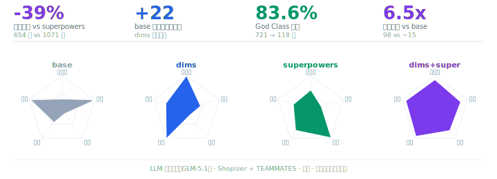
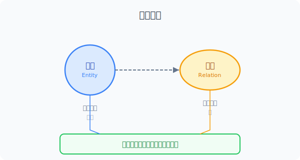
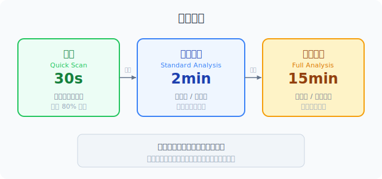

<p align="center">
  
</p>

> 同变的归一，异变的拆开。

## DVA 解决什么问题

**代码没有意义，业务才有。** 但业务在变，代码跟不上就会变成负债——改一个需求牵连三处，改着改着功能就坏了，最后谁都不敢动。

DVA 是给 AI Agent 的分析指令。让 Agent 在生成代码之前，找到变化节奏不同的地方，把它们隔开。结果是：

- **改动不扩散**：需求变了，只改一处，不动其他模块
- **功能不退化**：改了 A 不会崩 B
- **代码仍然可读**：不是过度设计的抽象，而是刚好够用的隔离
- **业务持续交付**：系统不会因为累积的耦合而越来越难改

不需要人来做这件事。把 DVA 指令给 Agent，Agent 自己分析、自己决策。

<p align="center">
  
</p>

## Agent 怎么用

三个深度，按场景选。大多数时候快扫就够。

### 快扫（30 秒）

**场景：** 日常编码。

Agent 写代码前过一遍：**这里什么会变？**

| 变化信号 | 例子 |
|---------|------|
| 做法经常换 | 运费规则每月调、折扣算法经常改 |
| 谁来做会换 | 接入新支付渠道、换物流供应商 |
| 东西越来越多 | 商品品类从 10 扩到 100 |
| 步骤和顺序会调 | 审批流程从 3 步变 5 步 |

有信号 → 在那个地方留口子（配置参数、回调、可替换的实现）。
没有 → 直接写，不预防。

### 标准分析（2 分钟）

**场景：** 新功能、新模块、改一个总崩的旧模块。

三步：

1. **找到实体和关系**：这个功能涉及哪些东西？它们之间怎么连？
2. **标注变化热点**：哪条关系的变化节奏和实体本身不对齐？
3. **决策**：不对齐的关系准备拆出去，从最轻的手段开始。

### 完整分析（10-15 分钟）

**场景：** 新项目启动、重大重构、系统改一处崩三处。

### 第一步：识别实体和关系

列出系统涉及的所有实体和它们之间的关系。

示例——电商订单系统：

| 实体 | 关系 | 关系在做什么 |
|------|------|------------|
| 订单 | — 计算运费 → | 运费规则 |
| 订单 | — 状态流转 → | 状态机 |
| 订单 | — 调用支付 → | 支付渠道 |
| 订单 | — 同步库存 → | 库存系统 |
| 订单 | — 包含 → | 订单项 |

### 第二步：标注变化速率

对每条关系标注变化速率和趋势：

| 关系 | 速率 | 趋势 |
|------|------|------|
| 订单 → 运费规则 | 高频 | 震荡 |
| 订单 → 状态机 | 低频 | 稳定 |
| 订单 → 支付渠道 | 中频 | 增长 |
| 订单 → 库存系统 | 高频 | 震荡 |
| 订单 → 订单项 | 低频 | 稳定 |

### 第三步：按变化速率分组

**速率和趋势一致的归在一起，不一致的拆开。**

- **订单骨架**：订单 + 订单项 + 状态流转 → 低频稳定 → 归在一起
- **运费策略**：运费规则 → 高频震荡 → 拆出来
- **支付适配**：支付渠道 → 中频增长 → 单独一组，会持续膨胀
- **库存同步**：库存数据 → 高频震荡 → 单独一组，变化独立

### 第四步：选拆分手段

每个需要拆出去的关系，从最轻的开始选：

| 变化特征 | 最轻的手段 | 更重的手段 |
|---------|-----------|-----------|
| 一个值经常变 | 配置文件 / 环境变量 | — |
| 一段逻辑经常换 | 回调 / 函数参数 | Strategy 模式 |
| 规则经常增减 | 数据表 / JSON 配置 | 规则引擎 |
| 实现经常换，接口不变 | 抽一层接口 | Bridge 模式 |
| 新类型不断出现 | 注册表 | Factory 模式 |
| 内部复杂，对外要简单 | 包一层函数 | Facade 模式 |
| 层级会加深 | 统一接口，递归组合 | Composite 模式 |
| 流程步骤经常调 | 管道 / 中间件链 | Chain of Responsibility |
| 操作要能撤销 | 记录操作对象 | Command 模式 |

**原则：能用配置文件解决的，不写 Strategy。能加一层函数解决的，不建类层次。重锤只在必要的时候用。**

### 第五步：验证

**第一轮：挡没挡住（保当下）** — 必须全过

1. 需求变了，改一个地方就能跟上吗？
2. 改了 A 不会崩 B 吗？
3. 来了意料之外的变化，能兜住吗？

**第二轮：挡住之后怎么样（保未来）** — 按项目阶段取舍

4. 改这个模块，需要动其他模块吗？
5. 三个月后需求大改，能接着迭代还是得重写？
6. 半年后看这段代码，还看得懂吗？
7. 改了之后，能快速验证没改坏吗？

原型期第二轮可以放宽松，生产系统必须全过。

**三个深度之间可以升级，不用一次到位。** 先快扫开始写，发现问题了停下来做标准分析。标准分析不够用，再上完整分析。

---

## 概念（为什么这些规则有效）

DVA 的全部理论只有两个概念：

- **实体（节点）**：持有状态。可以有简单的自述行为（只碰自己的数据），也可以完全没有行为。
- **关系（边）**：连接实体。系统的复杂行为，本质上都是关系在运转。

设计的核心决策只有一个：**行为的住所。** 一段逻辑该住在实体内部，还是该住到外面去？

判据是**变化速率是否对齐**：

- 这段逻辑的变化节奏和实体本身一样？ → **内化**（收进实体）
- 不一样，甚至经常冲突？ → **外化**（拆出去，变成独立实体或外部配置）

举例：
- `totalPrice = sum(items.price)` — 简单求和，和订单同生共死 → 内化进 Order
- 运费计算规则每月调，订单结构半年不动 → 节奏不对齐 → 必须外化

一句话总结：**同变的归一，异变的拆开。**

## 设计模式和 DVA

大部分设计模式是**关系外化的标准拓扑**。当你把一条隐式的关系变成显式的、可独立变化的实体时，就自然推导出了某个设计模式。

| 关系的什么在变 | 拓扑形状 | 对应的模式 |
|-------------|---------|-----------|
| 谁来做 | 星形 | Strategy / State / Visitor |
| 怎么创建 | 三角 | Factory / Builder / Prototype |
| 谁被通知 | 辐射 | Observer / Mediator |
| 什么时候做 | 瞬时→持久 | Command / Memento |
| 怎么连 | 插入中间节点 | Facade / Adapter / Bridge / Proxy / Decorator |
| 一个还是多个 | 树形 | Composite / Iterator |
| 按什么顺序 | 链式 | Template Method / Chain of Responsibility |

不是所有 23 个模式都纯粹是外化。Singleton 管约束，Flyweight 管内存，Interpreter 管语法——它们各有各的动机。DVA 能解释大部分模式从何而来，但不应强行解释全部。

## 和现有理论的关系

DVA 不取代任何已有方法，它是所有方法的**上游分析步骤**：

```
DVA（分析实体、关系、变化速率）
  ↓
决定行为的住所（内化 or 外化）
  ↓
选择外化手段：
  ├── 最轻量：配置、回调、数据驱动
  ├── PEAA 模式：Transaction Script / Table Module / Domain Model
  ├── GoF 设计模式：Strategy、Facade、Composite...
  ├── DDD 战术：聚合、值对象、领域事件
  └── 其他任何合适的手段
```

先分析，再选工具。不预设路线。

## 给 AI Agent 的指令

如果你用 AI 写代码（Claude、Cursor、Copilot 等），把这段话给 AI：

> 写代码前做 DVA 分析。按场景选深度：
>
> **日常编码（快扫）：** 想一下"这里什么会变"，在容易变的地方留配置口子或回调参数。不要过度设计。
>
> **新功能/新模块（标准分析）：** 找到实体和关系，标注变化热点（哪条关系的变化节奏和实体不对齐），在不齐处做隔离。不要默认使用任何架构框架。
>
> **新项目/重大重构（完整分析）：** 列出所有实体和关系，标注变化速率和趋势，按一致性分组，每个拆分点从最轻量的手段开始选（配置 > 回调 > 接口 > 设计模式）。验证功能可用、稳定性、鲁棒性。
>
> 大多数时候快扫就够了。不要每次都做完整分析。

## 模型的边界

DVA 用变化速率对齐作为**主要判据**，但不是唯一判据。实际设计中还需要考虑：

- **可读性**：有时外化会让代码更难读，即使变化速率不对齐也值得内化
- **团队习惯**：团队不熟悉的模式，用了反而增加认知负担
- **系统一致性**：与现有架构风格保持统一有时比局部最优更重要
- **约束型模式**：Singleton、Flyweight 等解决的是约束问题，不是变化问题

## 名词表

| 术语 | 含义 | 一句话 |
|------|------|--------|
| 实体 | 持有状态的节点 | Order、User、Product |
| 关系 | 连接实体的边，系统的行为在关系上运转 | "订单计算运费"、"订单调用支付" |
| 内化 | 关系收敛进实体，实体变充血 | totalPrice 写在 Order 里 |
| 外化 | 关系从实体剥离，变成独立实体或配置 | 运费计算拆成独立的 PricingService |
| 变化速率对齐 | 行为的变化节奏和实体本身是否同步 | 对齐→内化，不对齐→外化 |
| 原子 | 变化速率一致的最小单元 | "订单骨架"或"运费策略" |
| DVA | 把变化速率不一致的关系沿边界分开 | "同变的归一，异变的拆开" |

---

## 实验现状与局限

目前完成了两轮对照实验（Shopizer + TEAMMATES），第三轮用英文 skill 重跑 TEAMMATES。以下是目前知道和不知道的：

**已验证的：**
- 中文 DVA skill 引导 Agent 找到更完整的改动范围（TEAMMATES 实验中 dims 的 22 个额外文件全部必要）
- "查现有"步骤有效防止过度设计
- dims+superpowers 组合在两轮实验中综合表现最稳定

**未验证的：**
- 英文 skill 的跨边界检测信号尚未标定到位（第三轮实验中英文 dims 漏了 R02 的前端改动，中文 dims 没有）
- 单一模型（GLM-5.1）的结论无法推广到其他模型
- 没有独立的代码正确性评分（只验证了编译通过）
- Token 统计数据不可靠（API 不返回子 Agent 的真实用量）

**需要帮助的：**
- 在更多模型上验证（Claude Sonnet、GPT-4、Gemini 等）
- 在更多项目类型上测试（微服务、单体、前端项目等）
- 英文 skill 的措辞校准
- 设计更严谨的实验协议（消除基础设施噪音、多轮取平均）

如果你在做软件工程相关的实验研究，或者对 AI 辅助编程的方法论评测有兴趣，欢迎交流。

---

*软件设计不是雕琢实体，而是管理行为的住所。该内化的内化，该外化的外化，判据是变化速率是否对齐。*




