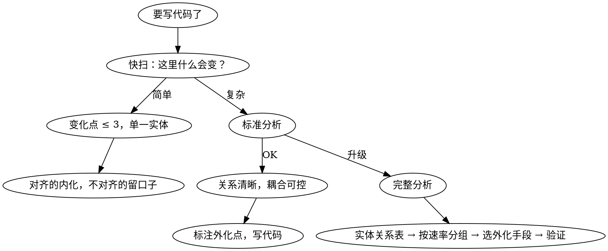

# 变维拆分 — 入口

写代码之前，想清楚一件事：**这段逻辑该住在实体里面，还是该拆出去？**

## 两个基元

- **实体（节点）**：持有状态，可以有简单的自述行为
- **关系（边）**：连接实体，系统的复杂行为都在关系上运转

## 核心判据

**变化速率是否对齐。** 一段逻辑的变化节奏和实体本身一样吗？
- 对齐 → **内化**（收进实体）
- 不对齐 → **外化**（拆出去）

## 选深度

| 场景 | 档位 | 耗时 | 调用 |
|------|------|------|------|
| 写任何代码之前 | 快扫 | 30 秒 | `change-dim-scan` |
| 新功能 / 新模块 / 改有问题的旧模块 | 标准分析 | 2 分钟 | `change-dim-split`（标准模式） |
| 新项目启动 / 重大重构 / 系统已经改一处崩三处 | 完整分析 | 10-15 分钟 | `change-dim-split`（完整模式） |

## 判断规则

1. **默认快扫。** 大多数时候脑子里闪一下就够。
2. **跨边界升级。** 需求涉及的数据类型是否同时被前后端（或不同层）使用？如果是，至少标准分析。实验数据：base 环境因为没做这个判断，漏改了 22 个前端文件，产出不可部署。
3. 如果快扫发现**变化速率不对齐的地方超过 3 个**，或者**涉及多个实体**，升级到标准分析。
4. 如果标准分析发现**关系之间互相纠缠**，或者**系统已经耦合严重**，升级到完整分析。
5. **不要跳过快扫直接做完整分析。** 过度分析和没有分析一样有害。

### 跨边界检测信号

以下任一条件成立，说明改动可能跨边界，至少需要标准分析：

- 要改的东西在系统中有多处副本（同名字段出现在多个模块/层/服务中）
- 需求涉及"移除"某个属性（移除会波及所有引用点）
- 需求涉及"类型变更"（可空性、枚举值变化，波及所有消费者）
- 需求涉及跨实体的唯一性或查找逻辑

## Anti-Pattern

- **每次都做完整分析。** 浪费时间。80% 的场景快扫就够。
- **跳过分析直接写代码。** "这个太简单了不用想" — 简单的地方才最容易埋雷。
- **分析完不用。** 想完了该外化的地方不外化，等于没想。
- **不查现有就新建。** 分析完直接新建接口/类，没检查现有代码是否已覆盖该变化速率。先查后建。
- **无法 justify 的新建。** 每个拟新建的文件/接口/类必须回答"为什么现有的不行"。答不上来的不新建。

## 流程

