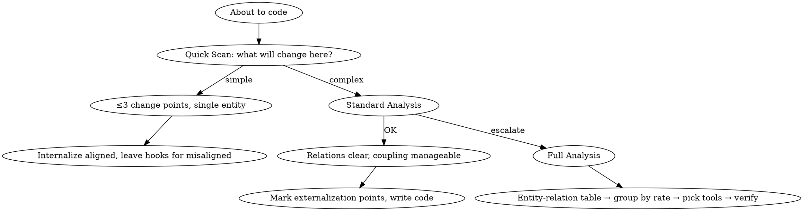

# DVA — Entry

Before writing code, answer one question: **should this logic live inside the entity, or be split out?**

## Two Primitives

- **Entity (node)**: holds state, may have simple self-describing behavior
- **Relation (edge)**: connects entities; complex system behavior runs on relations

## Core Criterion

**Is the rate of change aligned?** Does this logic change at the same pace as the entity itself?
- Aligned → **Internalize** (keep inside the entity)
- Misaligned → **Externalize** (split out)

## Pick a Depth

| Scenario | Depth | Time | Skill |
|----------|-------|------|-------|
| Before writing any code | Quick Scan | 30 seconds | `change-dim-scan` |
| New feature / new module / fixing troubled code | Standard Analysis | 2 minutes | `change-dim-split` (standard) |
| New project / major refactor / system breaks on every change | Full Analysis | 10-15 minutes | `change-dim-split` (full) |

## Decision Rules

1. **Default to Quick Scan.** A flash of thought is enough most of the time.
2. **Upgrade on cross-boundary changes.** Does the requirement affect data types used across multiple layers or services? If yes, use at least Standard Analysis. Experiment data: the baseline environment missed 22 frontend files by skipping this check, producing undeployable output.
3. If Quick Scan finds **more than 3 misaligned change rates** or **multiple entities involved**, upgrade to Standard Analysis.
4. If Standard Analysis finds **intertangled relations** or **heavily coupled code**, upgrade to Full Analysis.
5. **Don't skip Quick Scan and jump to Full Analysis.** Over-analysis is as harmful as no analysis.

### Cross-Boundary Detection Signals

If any of these conditions hold, the change likely crosses boundaries — use at least Standard Analysis:

- The thing you're changing has multiple copies in the system (same-named field appears across modules/layers/services)
- The requirement involves "removing" an attribute (removal cascades to all reference points)
- The requirement involves "type changes" (nullability, enum value changes — cascades to all consumers)
- The requirement involves cross-entity uniqueness or lookup logic

## Anti-Patterns

- **Doing full analysis every time.** Wastes time. Quick scan covers 80% of cases.
- **Skipping analysis entirely.** "This is too simple to think about" — simple places are where bugs hide best.
- **Analyzing but not acting.** Identifying misaligned change rates but not externalizing is the same as not analyzing.
- **Creating new things without checking existing code.** Before creating a new interface/class, check if existing code already covers that rate of change. Check first, build second.
- **Unjustified new files.** Every proposed new file/interface/class must answer "why don't the existing ones work?" If you can't answer, don't create it.

## Flow

